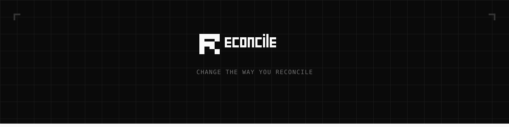
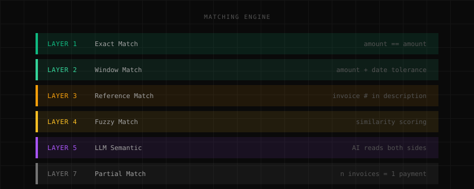

<p align="center">
  <picture>
    <source media="(prefers-color-scheme: dark)" srcset="public/brand/social/readme-banner-dark.svg">
    <source media="(prefers-color-scheme: light)" srcset="public/brand/social/readme-banner-light.svg">
    
  </picture>
</p>

<p align="center">
  <code>Automated cash-accrual reconciliation with 5-layer AI matching</code>
</p>

<p align="center">
  <a href="#the-matching-engine"><code>Engine</code></a>&nbsp;&nbsp;&nbsp;
  <a href="#tech-stack"><code>Stack</code></a>&nbsp;&nbsp;&nbsp;
  <a href="#getting-started"><code>Setup</code></a>&nbsp;&nbsp;&nbsp;
  <a href="#architecture"><code>Architecture</code></a>&nbsp;&nbsp;&nbsp;
  <a href="#project-structure"><code>Structure</code></a>&nbsp;&nbsp;&nbsp;
  <a href="#documentation"><code>Docs</code></a>
</p>

<br>

---

Bank says one thing. Invoices say another. Reconcile figures out who's lying.

> Spoiler: it's usually the dates.

---

<br>

## The Matching Engine

Reconcile matches bank transactions (cash basis) against invoices and receipts (accrual basis) through a pipeline of increasingly intelligent layers. Unmatched items cascade down.

<p align="center">
  
</p>

> Layer 6 is you doing it manually. We don't talk about Layer 6.

**Confidence scoring** determines what happens next:

```
>=90%   auto-approved     the engine is certain
70-89%  suggested         human reviews
<70%    suspense          needs investigation
```

Race condition protection is built in. Two matches can't claim the same transaction.

<br>

## Tech Stack

```
Frontend        Next.js 16 + React 19 + TypeScript      Turbopack, server components
Backend         Convex 1.31                              Real-time sync, matching engine, zero SQL
AI/LLM          AWS Bedrock + Vertex AI                  Claude Sonnet 4, Opus 4.5, Gemini
OCR             Python FastAPI + Mistral                 PDF extraction, deployed on Fly.io
PDF Reports     Python + ReportLab                       Branded financial reports
Auth            WorkOS                                   Enterprise SSO via AuthKit
Styling         Tailwind CSS v4                          Utility-first, sharp edges, no radius
Docs            Fumadocs                                 User-facing documentation
```

<br>

## Getting Started

```bash
# Install dependencies
pnpm install

# Terminal 1: frontend
pnpm dev

# Terminal 2: backend
npx convex dev
```

Two terminals. No Docker. No Kubernetes. No YAML files.

Copy `.env.example` to `.env.local` and fill in the blanks. Don't commit your secrets.

<br>

## Running Tests

```bash
pnpm test              # Vitest
pnpm test:coverage     # With coverage report
pnpm test:e2e          # Playwright E2E
cd ml && pytest        # Python ML service
```

Coverage thresholds: **65%** statements, **55%** branches, **65%** functions, **65%** lines.

<br>

## Architecture

**2-tier architecture** -- browser + Convex serverless, supplemented by Next.js API routes and a Python ML microservice.

```
                           +-------------------+
                           |     Browser       |
                           |  React 19 + Zustand|
                           +--------+----------+
                                    |
                    +---------------+---------------+
                    |                               |
           +--------v--------+           +---------v---------+
           |   Convex 1.31   |           | Next.js API Routes|
           |                 |           |                   |
           | - Data layer    |           | - AI chat (SSE)   |
           | - Matching      |           | - Auth callbacks  |
           | - Extraction    |           | - CSV import      |
           | - Cron jobs     |           | - Matching stream |
           | - Auth verify   |           |                   |
           +---------+-------+           +---------+---------+
                     |                             |
                     |                    +--------v--------+
                     |                    | Python FastAPI  |
                     |                    | (Fly.io)        |
                     |                    |                 |
                     |                    | - OCR (Mistral) |
                     |                    | - PDF generation|
                     +--------------------+-----------------+
```

<br>

## Project Structure

```
app/
  (app)/                  Authenticated routes (dashboard, upload, reconcile, reports)
  (main)/design/          Design system showcase
  api/                    API routes (AI chat, matching stream, auth, import)

components/
  brand/                  20+ branded UI components, pixel icon system, 3D logo
  views/                  Page-level view components
  ai/                     AI assistant components
  spreadsheet/            Agentic spreadsheet

convex/
  matching/
    engine.ts             Orchestrator
    layers/               Each layer is its own module
  lib/                    Auth, validators, errors, audit logging
  schema.ts               30+ tables

lib/
  ai/                     Bedrock provider, prompts, input sanitization
  store/                  Zustand -- single store, domain-grouped selectors

ml/                       Python ML service (Fly.io)
  services/               OCR, PDF generation, bank parsers
```

<br>

## The Design System

Reconcile ships with a comprehensive design system built on geometric absolutism. Every visual element -- from the logo to the 150+ pixel-art icon set -- is constructed exclusively from rectangles.

```
Radius:         0rem (sharp edges only)
Palette:        Monochromatic with semantic accents
Typography:     Inter (400, 500) + system monospace
Icons:          150+ custom pixel-art, 16x16 grid, rectangles only
Mode:           Dark-first
Animations:     Rectangle reveals, venetian-blind transitions
```

Explore the live design system at `/design`.

<br>

## Documentation

| Resource | Description |
|----------|-------------|
| `agent_docs/` | Internal architecture docs |
| `docs/` | User-facing docs (Fumadocs) |
| `CLAUDE.md` | AI agent instructions |
| `Reconciled-PRD.md` | Original product vision |

<br>

## License

Proprietary.

<br>

---

<p align="center">
  <picture>
    <source media="(prefers-color-scheme: dark)" srcset="public/brand/logos/logo-with-text-dark.svg">
    <source media="(prefers-color-scheme: light)" srcset="public/brand/logos/logo-with-text-light.svg">
    
  </picture>
</p>

<p align="center">
  <sub>Numbers that agree.</sub>
</p>
