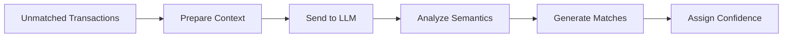

# Semantic Matching

Layer 5 of the matching system uses Large Language Models (LLMs) to understand the meaning and context of transactions. This enables matching that simpler pattern-based systems cannot achieve.

## What is Semantic Matching?

Traditional matching relies on:
- Exact numbers
- Pattern matching (regex)
- String similarity

Semantic matching goes further by **understanding what transactions mean**:

| Traditional | Semantic |
|-------------|----------|
| "INV-001" matches "INV-001" | "January stock purchase" matches "Q1 inventory order" |
| "5000.00" matches "5000.00" | Understands partial payments |
| "ABC Trading" ~ "ABC Trade" | "Payment to supplier" relates to "Vendor invoice" |

## How It Works



<Steps>
  <Step title="Context Preparation">
    The system gathers:
    - Transaction descriptions
    - Amounts and dates
    - Vendor/customer names
    - Historical matching patterns
    - Category information
  </Step>

  <Step title="LLM Analysis">
    The context is sent to Claude or Mistral via AWS Bedrock. The AI analyzes:
    - Language patterns
    - Business context
    - Temporal relationships
    - Amount correlations
  </Step>

  <Step title="Match Generation">
    The AI returns:
    - Potential matches with reasoning
    - Confidence scores
    - Explanation of match logic
  </Step>

  <Step title="Confidence Scoring">
    Final confidence is calculated from:
    - AI confidence in match
    - Supporting factors (amount, date proximity)
    - Historical accuracy for similar matches
  </Step>
</Steps>

## When Semantic Matching Helps

### Abbreviated Descriptions

Banks often truncate or abbreviate transaction descriptions:

| Bank Statement | Invoice | AI Understanding |
|----------------|---------|------------------|
| "TT 15/1 STK PURC" | "Stock Purchase - January Batch" | AI understands "STK PURC" = "Stock Purchase" |
| "PYT-ABC-2401" | "Payment to ABC Corp" | AI recognizes payment code pattern |

### Different Terminology

Same transaction, different words:

| Cash Side | Accrual Side | AI Insight |
|-----------|--------------|------------|
| "Laptop purchase" | "IT Equipment Acquisition" | Same category, likely same transaction |
| "Monthly hosting" | "Server rental - January" | Recurring IT expense pattern |

### Multi-Part Transactions

Payments split across multiple transactions:

| Scenario | AI Handling |
|----------|-------------|
| Invoice: RM 10,000 | Two payments: RM 6,000 + RM 4,000 |
| Payment installments | AI identifies partial payment pattern |
| Bulk clearing | AI matches batch to individual items |

### Temporal Relationships

Understanding timing context:

| Pattern | AI Recognition |
|---------|----------------|
| "Salary Dec" paid in January | Month-end payroll timing |
| Invoice dated 31st, paid 2nd | Normal clearing delay |
| Quarterly payment | Matches to period invoices |

## AI Models Used

Reconciled uses AWS Bedrock for AI inference:

| Model | Use Case | Characteristics |
|-------|----------|-----------------|
| Claude (Anthropic) | Primary matching | High accuracy, strong reasoning |
| Mistral | Fallback/High volume | Fast, cost-effective |

### Model Selection

- **Claude** is used for complex matches and lower-volume processing
- **Mistral** handles high-volume batches and simpler patterns
- System automatically routes based on complexity and load

## Confidence Calculation

Semantic match confidence ranges from 70-89%:

```
Base Semantic Score: 70%

Bonuses:
+ Amount exact match: +5%
+ Date within 7 days: +3%
+ Vendor name similar: +5%
+ Reference found: +4%
+ High AI confidence: +3%

Maximum semantic: 89%
```

<Note>
  Semantic matches cap at 89% because they require human verification. Matches above 90% come from more deterministic layers.
</Note>

## Reviewing Semantic Matches

Semantic matches show additional information:

### Match Reasoning

Each AI match includes an explanation:

> **AI Reasoning:** "Both transactions refer to office supplies purchased in mid-January. The bank description 'OFDEPOT JAN15' likely abbreviates 'Office Depot January 15'. The invoice from 'Office Depot Inc.' for $456.78 matches the bank amount exactly."

### Confidence Breakdown

Hover over confidence to see factors:

| Factor | Contribution |
|--------|--------------|
| AI Confidence | +12% |
| Amount Match | +5% |
| Date Proximity | +3% |
| **Total** | **70% + 20% = 90%** |

### Override Options

If you disagree with AI reasoning:

1. Click **Reject** to remove the match
2. Optionally provide feedback ("Incorrect match")
3. Feedback improves future matching

## Tuning Semantic Matching

### Enable/Disable

Go to **Settings** > **Reconciliation** > **AI Matching**

- **Enabled** — Unmatched items go through Layer 5
- **Disabled** — Skip semantic analysis (faster, less matches)

### Sensitivity

Adjust AI matching threshold:

| Setting | Effect |
|---------|--------|
| Strict (80%+) | Only high-confidence AI matches |
| Standard (70%+) | Default, balanced approach |
| Permissive (60%+) | More matches, more review needed |

### Cost Considerations

AI matching uses API calls which may affect your plan limits:

| Plan | AI Calls/Month |
|------|----------------|
| Free | 500 |
| Pro | 10,000 |
| Enterprise | Unlimited |

<Tip>
  If you're hitting AI limits, consider raising the confidence threshold so only difficult matches use AI.
</Tip>

## Privacy and Security

### What Data is Sent?

Only transaction metadata goes to AI:
- Description text
- Amounts
- Dates
- Vendor names

**Not sent:**
- Bank account numbers
- Full file contents
- Personal information

### Data Handling

- All API calls encrypted in transit
- AWS Bedrock processes data without retention
- No training on your data
- Regional data residency options available

## Improving Match Quality

### Provide Better Descriptions

Richer invoice descriptions improve AI matching:

| Poor | Better |
|------|--------|
| "Payment" | "Payment for January office supplies" |
| "Invoice" | "Monthly IT support - Jan 2024" |

### Add Vendor Aliases

Help AI recognize vendor variations:

**Settings** > **Company** > **Vendor Aliases**

```
Official Name: Microsoft Corporation
Aliases: MSFT, Microsoft, MS Corp, Microsoft*
```

### Review and Feedback

Approving/rejecting matches helps the system learn patterns:

- Approved matches confirm patterns
- Rejected matches flag incorrect assumptions

## Troubleshooting

<Accordion title="AI matches are too aggressive">
  Raise the confidence threshold in Settings > Reconciliation.
  Consider disabling AI matching and using manual review for complex items.
</Accordion>

<Accordion title="AI matches are too conservative">
  Lower the confidence threshold.
  Add more vendor aliases to help recognition.
  Ensure descriptions are detailed.
</Accordion>

<Accordion title="Matches are taking too long">
  Large batches may take 30-60 seconds.
  Consider processing in smaller batches.
  Check your AI call quota hasn't been exceeded.
</Accordion>

## Next Steps

<CardGroup cols={2}>
  <Card title="How Matching Works" icon="layer-group" href="/reconciliation/how-it-works">
    Learn about all 5 matching layers
  </Card>
  <Card title="AI Formulas" icon="function" href="/workspaces/ai-formulas">
    Use AI in workspaces with ENRICH formulas
  </Card>
</CardGroup>
