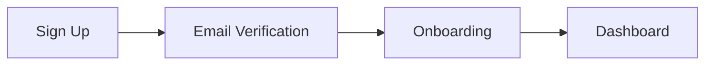

# Creating Your Account

Reconciled uses WorkOS AuthKit for secure authentication. You can sign up using social login or email.

## Sign Up Methods

<Tabs>
  <Tab title="Social Login (Recommended)">
    The fastest way to get started:

    1. Go to [reconciled.app](https://reconciled.app)
    2. Click **Get Started**
    3. Choose **Continue with Google** or **Continue with Microsoft**
    4. Authorize Reconciled to access your basic profile
    5. You're signed in and ready for onboarding

    <Tip>
      Social login is recommended because it's faster and you don't need to remember another password.
    </Tip>
  </Tab>

  <Tab title="Email & Password">
    Create a traditional account:

    1. Go to [reconciled.app](https://reconciled.app)
    2. Click **Get Started**
    3. Enter your email address
    4. Create a strong password (minimum 8 characters)
    5. Verify your email via the confirmation link
    6. Sign in to continue to onboarding
  </Tab>
</Tabs>

## What Happens After Sign Up

After creating your account, you'll be redirected to the onboarding flow:

The onboarding process collects your company information and preferences. See [Onboarding](/getting-started/onboarding) for details.

## Account Security

Reconciled takes security seriously:

- **Encrypted connections** — All data transmitted over HTTPS
- **Secure authentication** — Powered by WorkOS enterprise-grade auth
- **No password storage** — For social login, we never see your password
- **Session management** — Automatic timeout after inactivity

## Troubleshooting

<Accordion title="I didn't receive the verification email">
  1. Check your spam/junk folder
  2. Add `noreply@reconciled.app` to your contacts
  3. Request a new verification email from the sign-in page
  4. Contact support if issues persist
</Accordion>

<Accordion title="Social login failed">
  1. Ensure pop-ups are enabled for reconciled.app
  2. Try a different browser
  3. Clear cookies and try again
  4. Use email signup as an alternative
</Accordion>

<Accordion title="I forgot my password">
  1. Go to the sign-in page
  2. Click **Forgot password?**
  3. Enter your email address
  4. Check your email for the reset link
  5. Create a new password
</Accordion>

## Next Steps

<Card title="Complete Onboarding" icon="arrow-right" href="/getting-started/onboarding">
  Set up your company profile and preferences
</Card>
