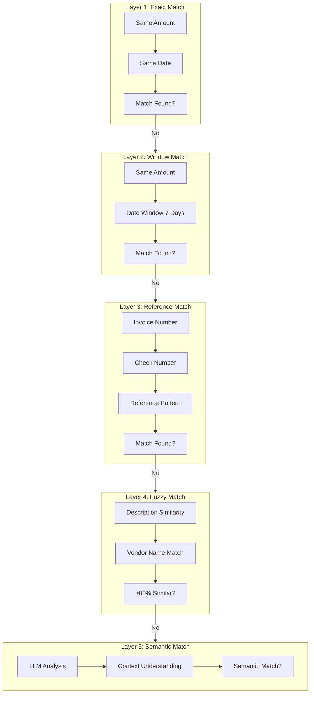

# How Reconciliation Works

Reconciled uses a sophisticated 5-layer matching system to automatically match bank transactions (cash basis) with invoices and receipts (accrual basis). Each layer uses a different matching strategy, progressing from simple exact matches to complex AI-powered semantic understanding.

## The 5-Layer Matching System



## Layer Details

### Layer 1: Exact Match

The simplest and most reliable match type.

**Criteria:**
- Amount matches exactly (to the cent)
- Date matches exactly

**Confidence:** 95-100%

**Example:**
| Bank Transaction | Invoice |
|------------------|---------|
| RM 5,000.00 on Jan 15 | RM 5,000.00 dated Jan 15 |

<Note>
  Exact matches are auto-approved unless you've disabled auto-matching in settings.
</Note>

---

### Layer 2: Window Match

Accounts for timing differences between bank processing and invoice dates.

**Criteria:**
- Amount matches exactly
- Dates within configurable window (default: 7 days before/after)

**Confidence:** 85-94%

**Example:**
| Bank Transaction | Invoice | Date Difference |
|------------------|---------|-----------------|
| RM 5,000.00 on Jan 18 | RM 5,000.00 dated Jan 15 | 3 days |

**Why dates differ:**
- Bank processing delays
- Check clearing time
- Payment made on different day than invoice

<Tip>
  Adjust the date window in Settings > Reconciliation if your business typically has longer payment cycles.
</Tip>

---

### Layer 3: Reference Match

Matches based on reference numbers found in transaction descriptions.

**What it looks for:**
- Invoice numbers (INV-001, #12345)
- Check numbers (CHK-2024-001)
- Purchase order numbers (PO-001)
- Reference codes mentioned in descriptions

**Confidence:** 80-94%

**Example:**
| Bank Description | Invoice Reference |
|------------------|-------------------|
| "TT TO ABC - INV-2024-0156" | INV-2024-0156 |

**Pattern matching includes:**
- INV-XXXX, INV#XXXX
- Invoice XXXX, Invoice #XXXX
- PO-XXXX, PO#XXXX
- REF-XXXX, REF#XXXX
- Numeric sequences (6+ digits)

---

### Layer 4: Fuzzy Match

Uses string similarity algorithms for partial matches.

**How it works:**
1. Normalizes text (lowercase, remove punctuation)
2. Compares using multiple algorithms:
   - Levenshtein distance
   - Token set ratio
   - Partial ratio matching
3. Combines scores for overall similarity

**Confidence:** 70-89%

**Example:**
| Bank Description | Invoice Description | Similarity |
|------------------|---------------------|------------|
| "PYMT ABC TRADING SDN BHD" | "ABC Trading Sdn Bhd - Invoice" | 82% |

**Matching factors:**
- Vendor/customer name similarity
- Transaction description overlap
- Amount proximity (if not exact)

<Warning>
  Fuzzy matches below 80% similarity are flagged as suggestions requiring review.
</Warning>

---

### Layer 5: Semantic Match (AI-Powered)

The most sophisticated layer uses Large Language Models (Claude or Mistral) to understand context and meaning.

**How it works:**
1. Sends unmatched transactions to LLM via AWS Bedrock
2. AI analyzes:
   - Transaction descriptions
   - Contextual clues
   - Business logic patterns
   - Temporal relationships
3. Returns match suggestions with reasoning

**Confidence:** 70-89%

**Example:**
| Bank Transaction | Invoice | AI Reasoning |
|------------------|---------|--------------|
| "TT 15/1 STOCK PURC" | "Inventory Purchase - Q1 Stock" | "Both refer to inventory/stock purchase in January. Amount matches within 2%." |

**When semantic matching helps:**
- Abbreviated descriptions
- Different terminology for same transaction
- Multi-part payments
- Cleared batches

See [Semantic Matching](/ai-features/semantic-matching) for more details.

---

## Confidence Thresholds

Every match receives a confidence score based on the matching criteria met:

| Confidence | Status | Action |
|------------|--------|--------|
| 90%+ | Auto-Matched | No action needed |
| 70-89% | Suggested | Quick review recommended |
| Below 70% | Suspense | Manual matching required |

### How Confidence is Calculated

```
Base Score (by layer):
- Layer 1 (Exact): 95%
- Layer 2 (Window): 85%
- Layer 3 (Reference): 80%
- Layer 4 (Fuzzy): 70%
- Layer 5 (Semantic): 70%

Bonuses:
+ Reference number found: +5%
+ Vendor name match: +5%
+ Amount exact: +5%
+ Date exact: +5%

Maximum: 100%
```

## Matching Process Flow

When you click **Reconcile**, here's what happens:

<Steps>
  <Step title="Preparation">
    System loads all unmatched transactions from both cash and accrual sides
  </Step>

  <Step title="Layer 1 Processing">
    Exact matches are identified first (fastest, most reliable)
  </Step>

  <Step title="Layer 2-4 Processing">
    Remaining transactions go through window, reference, and fuzzy matching
  </Step>

  <Step title="Layer 5 Processing">
    Truly difficult matches are sent to the AI for semantic analysis
  </Step>

  <Step title="Results">
    All matches are compiled with confidence scores and presented for review
  </Step>
</Steps>

## Tuning Match Settings

Customize matching behavior in **Settings > Reconciliation**:

| Setting | Default | Range | Effect |
|---------|---------|-------|--------|
| Date Window | 7 days | 1-30 days | Wider = more Layer 2 matches |
| Auto-Match Threshold | 90% | 70-100% | Higher = fewer auto-matches |
| Fuzzy Threshold | 70% | 50-90% | Lower = more fuzzy matches |
| Enable AI Matching | Yes | Yes/No | Toggle Layer 5 |

## Next Steps

<CardGroup cols={2}>
  <Card title="Review Workflow" icon="clipboard-check" href="/reconciliation/review-workflow">
    Learn how to approve and reject matches efficiently
  </Card>
  <Card title="Semantic Matching" icon="brain" href="/ai-features/semantic-matching">
    Deep dive into AI-powered matching
  </Card>
</CardGroup>
